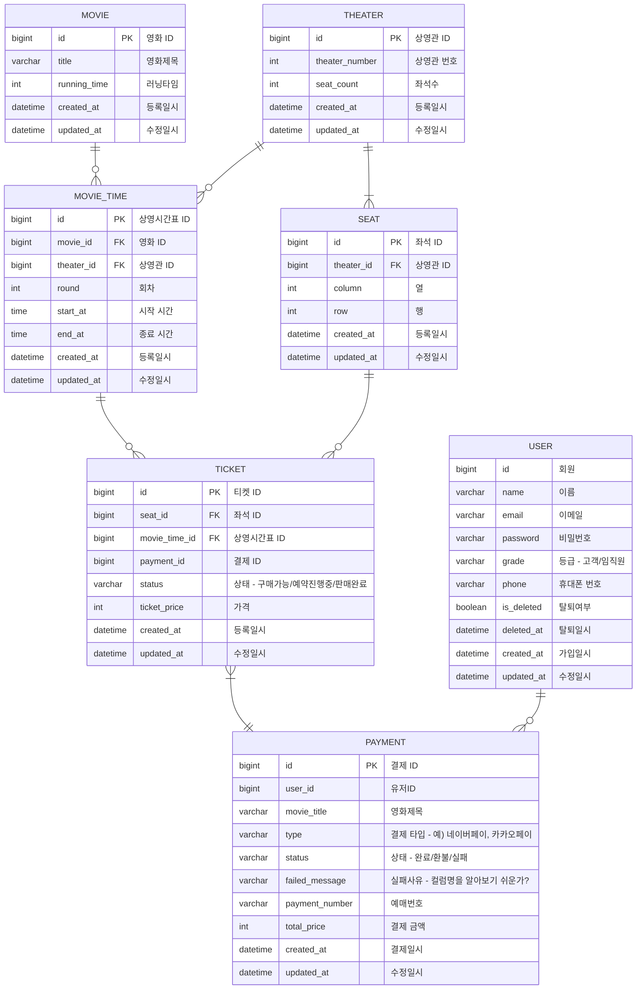

# Real-space

Real space company web page management system
会社ウェブページ管理システム

RealSpace の建築ディーサインをイメージ中心にアップロード及び管理する為のシステム 
：多量のイメージを簡単に安く管理するように設計

 

## 📆 Project period

### 22.03 ~ 22.04,

### 22.07 ~

 

## 🎯 프로젝트 주요 관심사

- 다량의 이미지 업로드 및 렌더링을 가장 저렴하고 안정적으로 구축하기 위한 시스템
- 테스트 코드를 통한 믿을 수 있는 코드 작성
- 코드리뷰를 통해 코드 품질 향상
- 코드 컨벤션 준수하여 코드 통일성 유지

 

## 🛠 기술스택

- Java 11
- Spring Boot 2.6.9
- Gradle
- Spring Security
- Junit 5
- Hibernate / SpringJPA
- MySQL 8.0
- Redis
- React.js
- Redux

 

## - [Git Branch Strategy]

- Git Flow

1. main : 제품으로 출시될 수 있는 브랜치
2. develop : 다음 출시 버전을 개발하는 브랜치
3. feature : 기능을 개발하는 브랜치
4. release : 이번 출시 버전을 준비하는 브랜치
5. hotfix : 출시 버전에서 발생한 버그를 수정 하는 브랜치

[gitFlow](https://user-images.githubusercontent.com/91414657/178094928-db77ef51-6492-4af7-9e36-4499b7bbce58.jpg)

## [Following AirBnb Code Convention](https://github.com/airbnb/javascript)

 

## 🧩 ERD Ex

